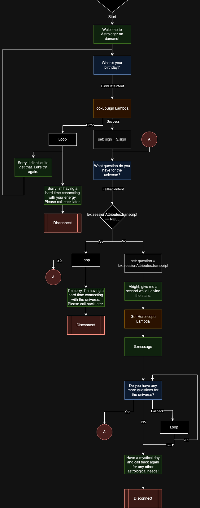

# InterVision Use Case

In this app. I've built an IVR that answers your questions about anything in the style of a horoscope.
I built two lambdas in Python and deployed them via CDK.

## IVR
Below is a diagram of the IVR.
Key:
Green = Play 
Blue = Get Customer Input
Orange = Lambda
Black/Grey = Systems Functions
Pink = Termination/Transition

## Lambdas

### Lookup Sign

This function takes in a date and determines which zodiac sign corresponds with the date.

### Generate Horoscope

This function takes in a zodiac sign and a question. Those values are used in a prompt which is then sent to a generative AI model (Amazon Bedrock + Llama 2 70B) to generate a response. That response is then processed and returned.

## Lex Bots

### BirthDateBot

This bot collects a date using a Date slot.

### YesNoTranscriptBot

This bot has the intents: Yes, No, and Fallback. The Fallback intent collects the transcript and saves it as a session attribute so the IVR can extract that value.

## IAC
To deploy the solution I used CDK. Included are the lambdas previously described and lambda function integrations into connect.

## Next Steps

Given this wasn't a couple hour project. These are some future directions I would consider:
- <b>Alternate prompts on loop</b>: If a caller is re-prompted for information, they would hear different prompts.
- <b> Multi-language support</b>: I would store the prompt information in DynamoDB and load the correct prompts depending on the language selected.
- <b>Saving user data to a database</b>: This way callers wouldn't have to specify their birth date again. We could then save their horoscopes to a database allowing users to retrieve them through other channels such as SMS, Email, or Web. Additionally, we could categorized horoscopes using SageMaker or Comprehend which would then give us a pool of targeted user data for marketing campaigns.